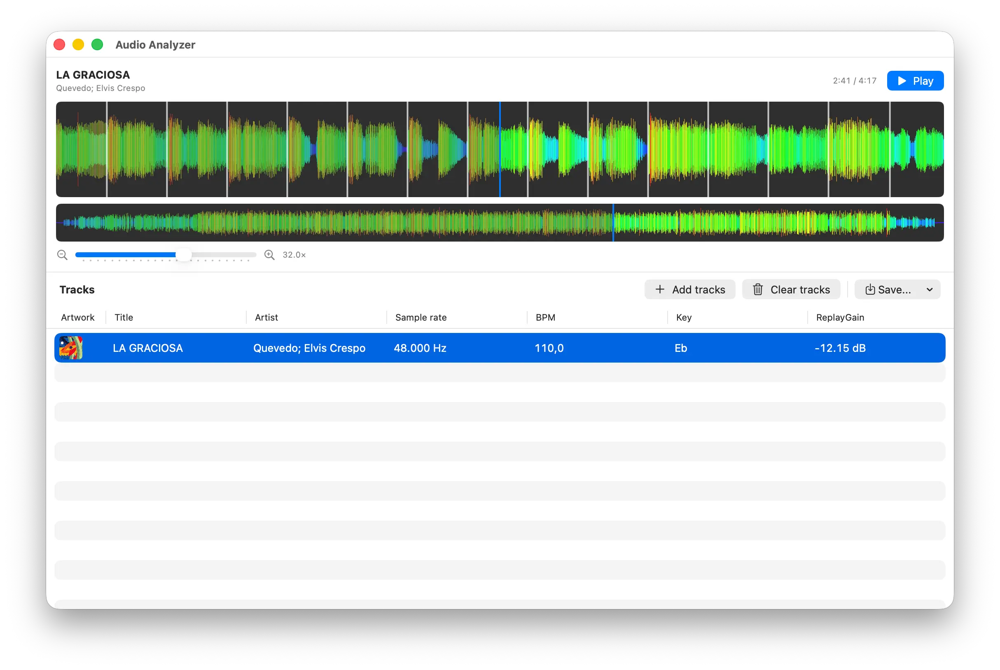

  <h1>Audio Analyzer</h1>
  

    Audio Analyzer is a macOS application that calculates the BPM, musical key,
    and ReplayGain of your audio files and lets you review the result on their
    waveform. Is built using 
    Swift and Apple's official frameworks, no web technologies are used.
  

  

## Features

- Import one or more files using the file picker or by dragging them into the track list.
- Read the title, artist, artwork, and stored BPM, musical key, and ReplayGain from file metadata.
- Automatically analyze each track's tempo, key, and ReplayGain, and show its analysis status, sample rate, detected BPM, key, and ReplayGain.
- View an overview waveform and a zoomed waveform with beat markers.
- Play and pause tracks, seek to any position, and adjust the zoom level.
- Adjust detected BPM to one half, 2/3, 3/4, 4/3, 3/2, or double.
- Explicitly save the BPM, musical-key, and ReplayGain values to the file's metadata.
- Optionally save calculated and manually adjusted values automatically.
- Choose a light, dark, or system theme, and configure waveform dimming, beat markers, and low-performance mode.

## Quick start

1. Open Audio Analyzer.
2. Click **Add tracks** or drag audio files into the track list.
3. Wait for the analysis to finish.
4. Select a track to view and play its waveform.
5. To correct the tempo, open the track's context menu and choose **Modify BPM**.
6. Choose **Save metadata values...** → **All**, **BPM**, **Key**, or **ReplayGain** to write the analysis to the file.

Analysis runs on the complete file and is independent of playback. Files are
not modified automatically: metadata is written only when you choose the save
option. If no detectable tempo, key, or ReplayGain is found, that value is left unavailable.

## Compatibility

- macOS 14.0 or later.
- Supported audio formats: MP3, FLAC, ALAC (M4A), OGG, Opus, and WAV. Files in any other format cannot be selected in the file picker, and importing them shows an unsupported-format alert.
- BPM, musical key, and ReplayGain values are saved natively for every supported format, using each container's native fields:

| Format | Extensions | BPM | Musical key | ReplayGain |
| --- | --- | --- | --- | --- |
| MP3 | `.mp3` | `TBPM` | `TKEY` | `TXXX:REPLAYGAIN_*` (ID3v2) |
| FLAC | `.flac` | `BPM` | `KEY` | `REPLAYGAIN_*` (Vorbis comments) |
| ALAC | `.m4a` | `tmpo` | `initialkey` | `REPLAYGAIN_*` (iTunes atoms) |
| OGG Vorbis | `.ogg`, `.oga` | `BPM` | `KEY` | `REPLAYGAIN_*` (Vorbis comments) |
| Opus | `.opus` | `BPM` | `KEY` | `REPLAYGAIN_*` and/or `R128_*_GAIN` (OpusTags, per preferences) |
| WAV | `.wav` | `TBPM` | `TKEY` | `TXXX:REPLAYGAIN_*` (embedded ID3 chunk) |

## Build from source

Open `Audio Analyzer.xcodeproj` in Xcode and run the **Audio Analyzer** scheme.
The project uses Swift and a C++20 analysis core.

## License and third-party components

The BPM analysis core contains code derived from [Mixxx] and [QM-DSP]. The
project is distributed under the **GNU General Public License, version 2.0
(GPL-2.0-only)** to preserve the obligations of those parts. Vendored
[KissFFT] code remains under its BSD-style license.

See [`LICENSE.md`](LICENSE.md) and
[`Audio Analyzer/THIRD_PARTY_NOTICES.md`](Audio%20Analyzer/THIRD_PARTY_NOTICES.md)
before redistributing the application.

[Mixxx]: https://github.com/mixxxdj/mixxx
[QM-DSP]: https://github.com/mixxxdj/mixxx/tree/main/lib/qm-dsp
[KissFFT]: https://github.com/mborgerding/kissfft
